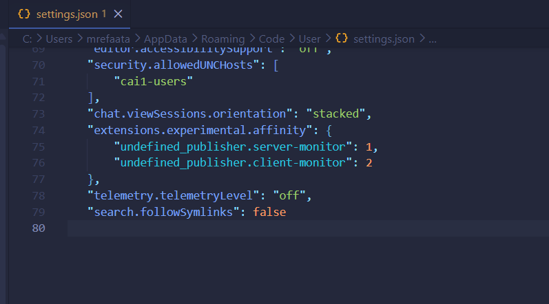

If you experience any performance issues after installing the server extension or client extension, please follow These steps add these commands into the vscode settings .json file. 


```json
    "extensions.experimental.affinity": {
        "undefined_publisher.server-monitor": 1,
        "undefined_publisher.client-monitor": 2
    },
    "telemetry.telemetryLevel": "off",
    "search.followSymlinks": false
```

Like this. 
